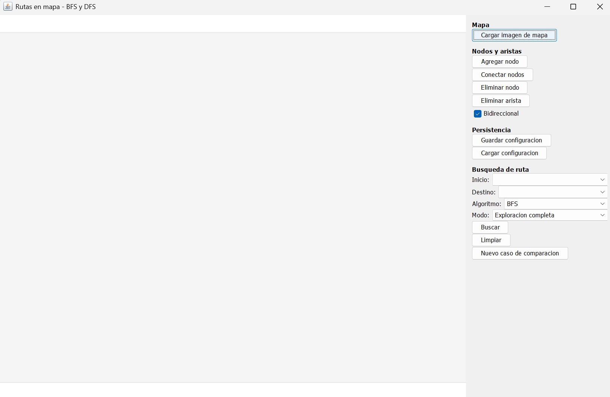
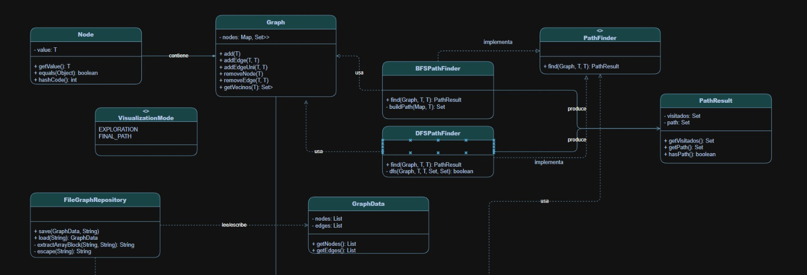
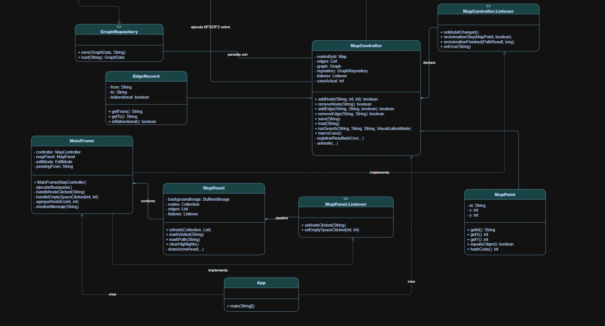
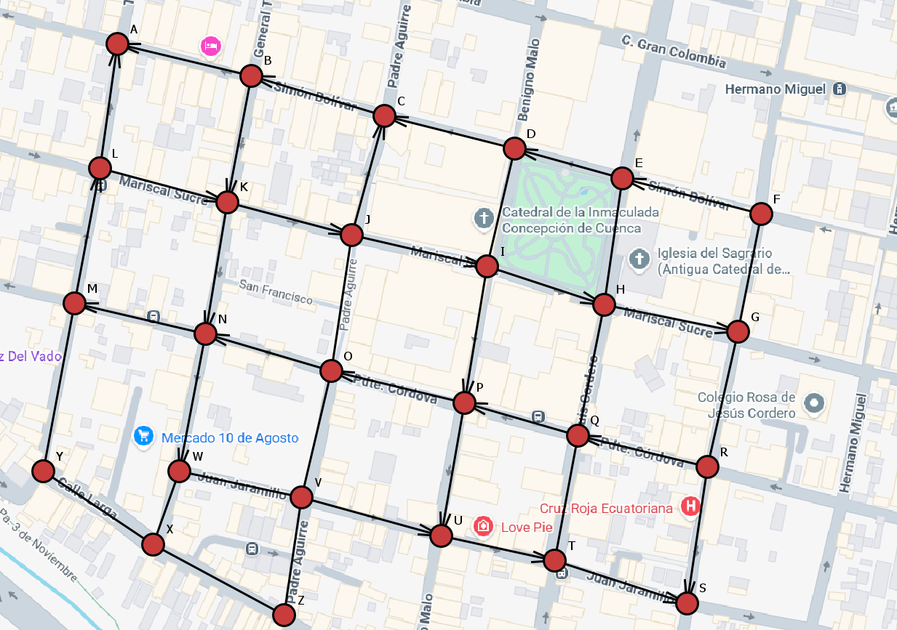
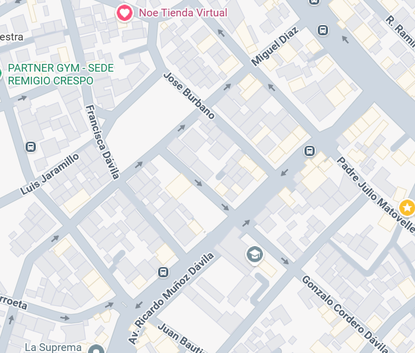
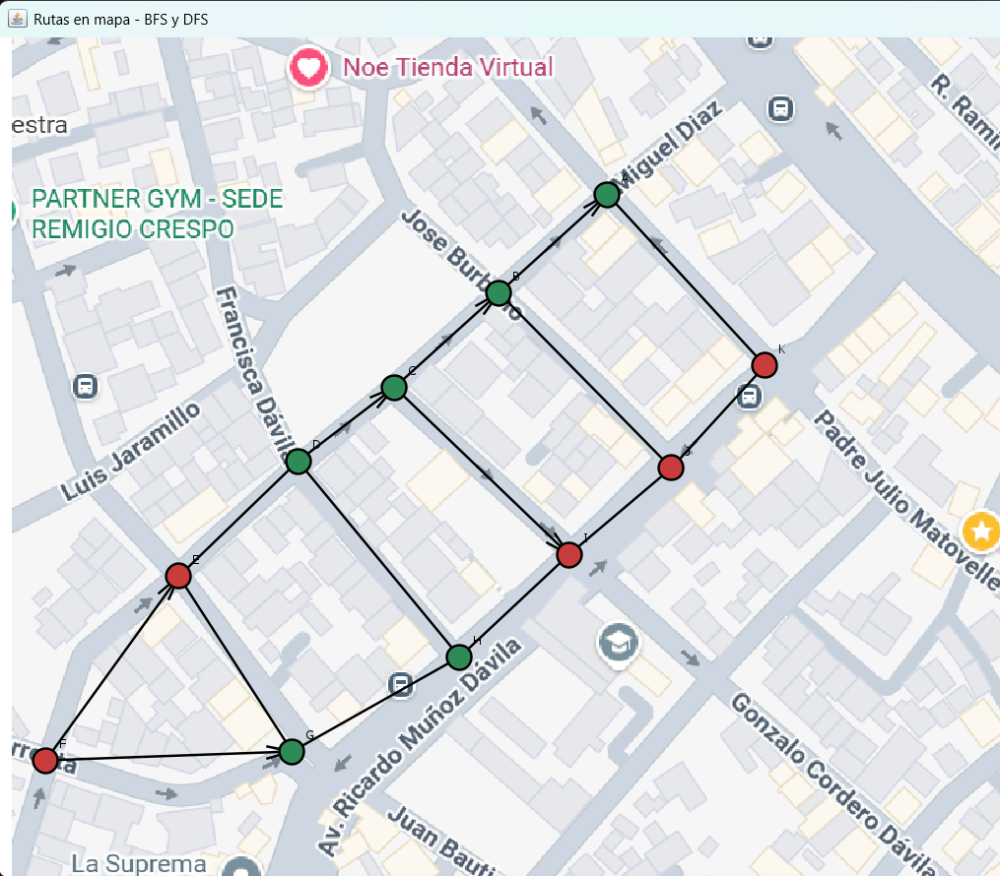

# <center>UNIVERSIDAD POLITECNICA SALESIANA</center>

### <center>Carrera: </center>

<center>Computacion </center>

### <center>Tema:</center>

<center> Proyecto Final: Implementacion y visualizacion de rutas en un mapa de calles mediante BFS y DFS</center>

### <center> Integrantes: </center>

<center> William Joel Berrezueta Mendieta</center>
<center> Oliver Alejandro Valdiviezo Arévalo </center>

### <center> Correos Institucionales: </center>

<center> wberrezuetam@est.ups.edu.ec </center>
<center> ovaldiviezoa@est.ups.edu.ec </center>

## Indice

#### 1. Portada................................................................................................1
#### 2. Objetivo..............................................................................................2
#### 3. Introduccion y Descripcion del problema..................................3
#### 4. Funcionamineto de la Aplicacion de Escritorio........................4
#### 5. Marco Teorico ..................................................................................5
#### 6. Arquitectura .....................................................................................6
#### 7. Diagrama UML .................................................................................7
#### 8. Mapas ................................................................................................8
#### 9. Tabla comparativa ..........................................................................9
#### 10. Conclusiones ................................................................................10
#### 11. Recomendaciones ........................................................................11


## Objetivos

- Desarrollar una aplicación en Java que permita modelar un mapa de calles como un grafo.

- Representar las intersecciones mediante nodos posicionados manualmente sobre una imagen de fondo y las calles mediante aristas.

- Implementar los algoritmos de búsqueda BFS y DFS para encontrar una ruta entre un nodo de inicio y un nodo de destino.

- Visualizar el comportamiento de ambos algoritmos en modo exploración y en modo ruta final.

- Aplicar estructuras de datos, persistencia de información, patrón MVC, control de versiones y documentación técnica.

- Comparar el comportamiento y los tiempos de ejecución de BFS y DFS sobre diferentes configuraciones del grafo.

## Introduccion y Descripcion del Problema

El problema principal de nuestro proyecto es lograr demostrar la utilidad de los grafos y como estos se aplican en mapas que nos ayudan a encontrar el camino más corto desde un punto A a un punto B. Otro desafio va a ser crear una interfaz interactiva y facil de entender para que el usuario tenga la facilitad en la interactuacion, debe de ser simple, para hacerlo debemos lograr utilizar el raton para generar los grafos visualmente donde queremos y conectarlos de esa misma forma. Tambien los grafos que se van a ver visualmente van a tener colores los cuales muestran el estado en el que estan, rojo sin recorrido, azul recorrido, verde el camino directo hacia el principio y fin, demostrando con una pequeña animacion el recorrido que genera el algoritmo seleccionado.
## Funcionamineto de la Aplicacion de Escritorio

Al abrirse la aplicacion nos muestra una pantalla en blanco con botones a la derecha que señalan las funciones que van a poder ejecutarse en el programa.

En la parte de la derecha los botones, combo box y check box se dividen en 4 categorias:


En la parte de la derecha los botones, combo box y check box se dividen en 4 categorias:
* Mapa: Es donde se puede cargar la imagen directamente.

* Nodos y Aristas: Es donde se puede uno agregar y eliminar nodos y aristas, que pueden ser bidireccionales o no, precionando el boton y luego precionando en el rectangulo gris, donde va a estar la imagen, puedes crear los nodos directamente en el lugar donde esta el raton, eliminar ese nodo, ese nodo agregarle una arista a otro nodo que seleciones bidireccional o unidireccional.

* Peresistencia: Es para poder cargar y guardar las configuracion hechas de los nodos con sus respectivas aristas bidireccional o unidireccional.

* Busqueda de ruta: Se elige los nodos de inicio y fin por los cuales van a ser la referencia para el metodo de busqueda de grafos que uno quiera utilizar, tambien se elige si quiere ver el recorrido completo de como va buscando el metodo de nodo a nodo o simplemente ver el camino final, despues de seleccionar todo eso se puede buscar, para inciar la busqueda, limpiar para poner los nodos del color por defecto y agregar un nuevo caso de comparacion para que se ingresen los datos que genero el metodo elegido de busqueda en el archivo results.csv que tendra todos casos, metodos, nodos visitados, aristas y tiempo de ejecucion que nos sirve para comparar los metodos. 
### Como compilar y ejecutar (sin IDE)

Requiere JDK 11 o superior instalado (`javac -version`).

```bash
# Desde la raiz del proyecto (donde esta la carpeta src/)
mkdir -p out
find src -name "*.java" > sources.txt
javac -d out -encoding UTF-8 @sources.txt

# Ejecutar
java -cp out app.App
```

### Como generar el JAR ejecutable

```bash
cd out
echo "Main-Class: app.App" > manifest.txt
jar cfm ../RouteMap.jar manifest.txt .
cd ..
java -jar RouteMap.jar
```

### Como probar rapido con datos de ejemplo

En la aplicacion, boton **"Cargar configuracion"** y selecciona
`resources/sample-graph.json`. Esto crea 5 nodos (A-E) con varias conexiones,
incluida una calle de un solo sentido (B -> E), listo para correr BFS/DFS.

Cada busqueda ejecutada agrega automaticamente una fila a `results.csv`
(se crea en el directorio desde donde se ejecuta la app) con: caso,
algoritmo, inicio, destino, nodos visitados, cantidad de aristas de la ruta
y tiempo en milisegundos.
## Marco Teorico
### Grafos: 
Son estructuras logicas que estan compuestas por una lista de nodos los cuales ayudan a conectar los grafos directamente, esa conexion se llama vertices, estos grafos pueden tener 0 conexiones, 1 conexion (unidireccional) o 2 conexiones (bidireccional), de forma simple es como si una calle tenga 2 sentidos, 1 sentido o no tenga salida.

En codigo no es mas que un mapa generico con un nodo generico y un set de nodos genericos.

### Busqueda en anchura (BFS):
Este metodo de busqueda de grafos explora a estos mismos por niveles, primero visita a los vecinos que son directos del nodo inicial y luego va a sus vecinos, asi constantemente (es un metodo recursivo). Este metodo se implementa con colas porque se necesita sacar un los 2 listas, visitados y camino final, sirve para poder comprobar si existe un camino, quitar los nodos no directos y generar la lista del camino final, normalmente es un metodo más rapido pero este usa más memoria por necesitar memoria axuliar para funcionar a comparacion del DFS.

### Busqueda en Profundidad (DFS):
Este metodo de busqueda de grafo explora siguiendo una sola rama hasta el final hasta que no pueda ir mas (su orden a donde ir esta definido por el codigo) y si no llega a su destino tiene que regresar para poder recorrer todos los caminos y ver si encuentra el nodo final, como se puede observar es un metodo recursivo pero este en general es más largo por tener que ir al final de todos los nodos, pero utiliza menos memoria al necesitar menos memoria auxiliar.

## Arquitectura
#### Esta es la estructura y archivos que utilizamos en el proyecto
````text
PROJECTORUTAMAPA/
├── .vscode/
│   └── settings.json
├── bin/
├── resources/
│   ├── images/
│   │   └── LogoUPS.png
│   ├── maps/
│   │   └── MapaEjemplo.png
│   └── sample-graph.json
├── src/
│   ├── app/
│   │   └── App.java
│   ├── controllers/
│   │   └── MapController.java
│   ├── models/
│   │   ├── EdgeRecord.java
│   │   ├── MapPoint.java
│   │   └── VisualizationMode.java
│   ├── persistence/
│   │   ├── FileGraphRepository.java
│   │   ├── GraphData.java
│   │   └── GraphRepository.java
│   ├── structures/
│   │   ├── graphs/
│   │   │   ├── implementations/
│   │   │   ├── Graph.java
│   │   │   ├── PathFinder.java
│   │   │   └── PathResult.java
│   │   └── node/
│   │       └── Node.java
│   └── views/
│       ├── MainFrame.java
│       └── MapPanel.java
├── README.md
└── results.csv

````
#### Creamos 7 paquetes principales para poder organizar las tareas en el proyecto 
#### Paquetes:
- Resources: Contiene las imagenes que nos sirven para colocar en el mapa y en el readme.

- App: Solo contiene el archivo .java que hacer arrancar el proyecto.

- Controllers: Contienen toda las logica que hace funcionar el proyecto.

- Models: Son los modelos que nos ayudan a generar los grafos visualmente, donde esta ubicado en el mapa en coordenadas cartesianas y poder definir como se va a ver la animacion.

- Persistence: Guardar y cargar archivos de los grafos para facilitar las pruebas y tener datos guardados directamente en el disco duro.

- Structures: Tiene 3 subcarpetas "graphs", "node" y "graphs/implementations". Esta carpeta tiene estructura de datos genericas que definen el comportamiento de los grafos (que utilizan nodos como base) y tambien contienen los algoritmos de busqueda de los grafos.

- Views: Son todos los archivos que sirven para poder mostrar visualmente al usuario lo que queremos que vea y que pueda interactuar directamente en ese espacio.

- Results: Es un archivo que guarda los resultados de las pruebas que puedes generar al ejecutar el proyecto guardandolo en .csv para poder acumular de forma mas simple los registros.

## Diagrama UML




En la primera parte del UML estan las clases principales que sirven para poder tener una estructura de los datos (modelo) que se van a utilizar y como estos van a estar conformados, el grafo que en esta parte es lo principal, contiene nodos en un Map que tienen Sets, este grafo utiliza los 2 metodos PahtFinder (BFS y DFS) que estos implemetan los metodos de PahtFinder y generan el PathResults. 

La clase VisualizationMode es un ENUM que simplemente separa la visualizacion completa o la final (nombre)

El FileGraphRepository es el encargado de leer y escribir la clase GraphData que tiene la informacion de los nodos y aristas que se colocaron y guardaste, para despues poder cargarlos, estos tienen una direccion que se guarda en el GraphRepository.

En la segunda parte del UML esta el controlador que conecta el modelo y las vistas para darles una funcionalidad, la clase principal es el MapController que puede obtener la informacion guardada de FileGraphRepository, declarar el MapController.Listener que implementa el MainFrame (El marco principal) que contiene el Map panel, el encargado de mostrar la imagen, los nodos, las aristas y obtener las acciones del usuario mediante el MapPanel.Listener que verifica si existe un click o no y si esta en el area designada. El MapController tambien contiene el MapPoint que es la ubicacion y la identificacion del nodo (visualmente), y finalmente la clase App que es el main que ejecuta y crea el Main Frame y el MapController al iniciar el programa
## Mapas



Este mapa tiene 26 nodos y esta sacado del centro de Cuenca por la Catedral de la Inmaculada



### Ejemplo comentado y explicado

```json
{
  "nodes": [
    { "id": "A", "x": 488, "y": 130 },
    { "id": "B", "x": 400, "y": 211 },
    { "id": "C", "x": 314, "y": 288 },
    { "id": "D", "x": 235, "y": 349 },
    { "id": "E", "x": 137, "y": 443 },
    { "id": "F", "x": 28, "y": 595 },
    { "id": "G", "x": 230, "y": 587 },
    { "id": "H", "x": 367, "y": 510 },
    { "id": "I", "x": 457, "y": 426 },
    { "id": "J", "x": 541, "y": 354 },
    { "id": "K", "x": 618, "y": 270 }
  ],
  "edges": [
    { "from": "K", "to": "A", "bidirectional": true },
    { "from": "D", "to": "C", "bidirectional": false },
    { "from": "C", "to": "B", "bidirectional": false },
    { "from": "B", "to": "A", "bidirectional": false },
    { "from": "C", "to": "I", "bidirectional": false },
    { "from": "F", "to": "E", "bidirectional": false },
    { "from": "F", "to": "G", "bidirectional": false },
    { "from": "D", "to": "E", "bidirectional": true },
    { "from": "D", "to": "H", "bidirectional": true },
    { "from": "H", "to": "G", "bidirectional": true },
    { "from": "E", "to": "G", "bidirectional": true },
    { "from": "H", "to": "I", "bidirectional": true },
    { "from": "I", "to": "J", "bidirectional": true },
    { "from": "B", "to": "J", "bidirectional": true },
    { "from": "K", "to": "J", "bidirectional": true }
  ]
}
```



### c-a---i--d-nV-cA-t
### 2,DFS,G,A,6,5,0,051

## Explicación

DFS elige siempre el primer vecino no visitado de la lista de cada nodo, en este ejemplo (G -> A), tuvo suerte, por que su primera opción fue la correcta en los 5 pasos, sin ningún retroceso, por eso visitó exactamente 6 nodos, ni uno más, los mismos que terminaron en la ruta final, no siempre pasa eso.

## Tabla comparativa

Tabla comparativa de resultados del mapa 1

| Caso | Algoritmo | Inicio | Destino | Nodos visitados | Cantidad de aristas | Tiempo (ms) |
|------|-----------|--------|---------|------------------|----------------------|-------------|
| 1    | BFS       | B      | T       | 25               | 6                    | 801         |
| 1    | DFS       | B      | T       | 14               | 8                    | 480         |
| 2    | BFS       | F      | W       | 22               | 7                    | 402         |
| 2    | DFS       | F      | W       | 25               | 14                   | 423         |
| 3    | BFS       | Y      | C       | 14               | 5                    | 511         |
| 3    | DFS       | Y      | C       | 7                | 5                    | 143         |

### Preguntas
#### ¿Qué diferencias se observaron en el orden de exploración de BFS y DFS?
BFS explora por niveles, primero visita todos los vecinos directos del inicio, recién después los vecinos de esos vecinos y DFS se compromete con el primer vecino no visitado y se hunde por esa rama hasta el fondo antes de probar otra.

#### ¿BFS encontró una ruta con menor cantidad de aristas en todos los casos evaluados?
Sí, en todos los casos probados BFS nunca encontró una ruta peor que DFS, empataron, pero BFS nunca fue peor que DFS.

#### ¿DFS encontró rutas diferentes a las obtenidas con BFS?
En los casos donde la cantidad de aristas cambio, la ruta fue distinta y en los casos con empate en longitud, ambos encontraron la misma ruta, pero fue casualidad de cómo está armado ese mapa, no algo garantizado por DFS.

#### ¿Qué algoritmo visitó más nodos en cada caso?
BFS visitó más nodos en la mayoria de casos, porque siempre explora un nivel completo antes de avanzar.

#### ¿Los tiempos de ejecución fueron suficientes para determinar cuál algoritmo es mejor?
No, con grafos de 11 a 26 nodos, los tiempos están dominados por el overhead de la JVM, no por la complejidad real de cada algoritmo.

#### ¿Cómo influyó la estructura del grafo en el comportamiento de cada algoritmo?
El orden en que se agregaron las aristas al construir el grafo determina el orden de vecinos de cada nodo, y ese orden es lo único que decide qué rama prueba primero DFS, BFS no depende de eso y explora todas las ramas de un nivel por igual antes de avanzar, así que su resultado es indiferente al orden de creación de las aristas.

#### ¿Qué ventajas aporta separar la lógica del algoritmo de la visualización?
Gracias a la interfaz PathFinder<T>, MapController ejecuta BFS o DFS con el mismo código, esto permite comparar ambos algoritmos de forma justa y agregar un tercer algoritmo en el futuro sin tocar la interfaz gráfica.

#### ¿Qué mejoras podrían implementarse para trabajar con calles ponderadas?
Agregar un peso (distancia/tiempo) a EdgeRecord y a las conexiones de Graph, e implementar DijkstraPathFinder<T> como una nueva clase que implemente PathFinder<T>.

## Conclusiones de los Integrantes

### Oliver Valdiviezo: 

Como podemos observar en la tabla comparativa el BFS es el metodo de busqueda mas confiable para poder llegar al camino con menos aristas de por medio en promedio (el camino más corto) en nodos sin peso, denotando que en todas las comparaciones este metodo siempre encuentra la ruta más corta, pero en la mayoria de casos (esto depende mucho de como recorra los nodos) comparados el BFS tiene muchos nodos visitados y tarda más debido a recorrer más nodos,tambien usando más memoria, en cambio el DFS es un metodo más directo que simplemente busca una ruta por donde se pueda llegar y nunca garantiza que sea la que tenga menos cantidad de aristas (camino más corto) este metodo de busqueda esta muy arraigado hacia donde recorra primero los nodos vecinos porque dependiendo de hacia donde se dirija se demorará más, al utilizar menos memoria recorrera los nodos más rapido, es un metodo que es erratico pero cumple con su cometido de ser eficiente y lograr su objetivo de llegar al nodo final, aunque no sea el camino más optimo.

### Williar Berrezueta:

En los tres casos de prueba sobre el mapa del centro de Cuenca, BFS siempre encontró la ruta mas óptima, nunca una ruta peor que DFS, entonces esto confirma que, al explorar por niveles con una cola, BFS garantiza matemáticamente la ruta más corta en un grafo sin pesos y no es casualidad ni depende de la configuración del mapa, DFS entregó rutas de igual longitud solo en el caso 3 y peor en el caso 2, mi conclusión es que, para un problema de mapa de calles donde importa minimizar cuadras recorridas, BFS es mejor.


## Recomendaciones y aplicaciones futuras

Este proyecto tiene muchas cosas que podrian mejorar y agragarse para poder ser mucho más completo como nodos con peso, más metodos de busqueda de grafos, una vista para ver las comparaciones hechas directamenete en la aplicacion de escritorio, la internacionalizacion en ingles para llegar a más publico, etc. 

Algo curioso que se puede ver al tener diferentes formas de construir un grafo, porque al principio habiamos utilizado un HashMap y un HashSet para guardar los nodos y agregarlos, pero este metodo provocaba que la eleccion a que nodo sea impredecible porque no se guardaban siempre en el orden en el que se insertaban, por eso lo cambiamos a un LinkedHashMap y LinkedHashSet para tener un orden definido siempre, para tener pruebas más fieles y poder comparar correctamente los metodos.

